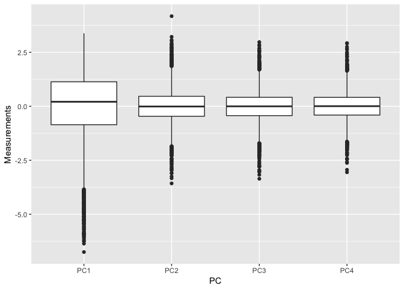
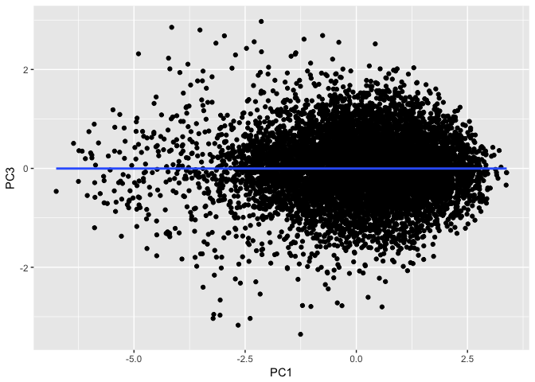
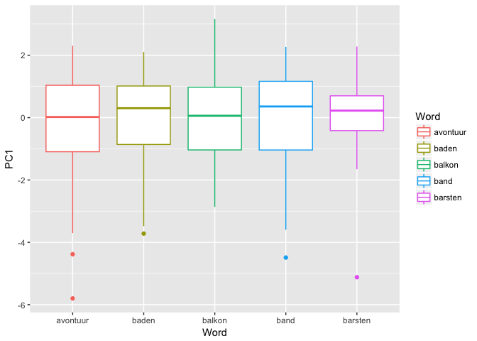

#General Observations
The languageR data sets are pretty messy and the hardest thing about them was the length of long data. That is the reaon why I used `slice()' to reduce it to the most essential parts. Also, not all variables correlate, so it required several trials to get to find the few that do. Finally, instead of a regression line as asked in the directions for this homework, I provided a line of best fit. It's certainly the case that these two lines don't exactly do the same think. If this is true, what is the difference between them?


#Tiding the data

###Using 'gather( )'


```r
beginningReaders %>%
  select(PC1, PC2, PC3, PC4) %>%
  gather(., key = PC, val = Measurements) %>%
  ggplot(., aes(x = PC, y = Measurements), color = PC) +
    geom_boxplot()
```

<!-- -->


###Using 'separate( )'


```r
beginningReaders %>%
  select(., PC2) %>%
  slice(., 1:20) %>%
  separate(., PC2, into = c('Subcondition', 'Subcondition')) 
```

```
## Warning: Too many values at 5 locations: 2, 5, 7, 8, 19
```

```
## # A tibble: 20 x 2
##    Subcondition    Subcondition
##  *        <chr>           <chr>
##  1            0 178975966298129
##  2                            0
##  3            0 373581513247147
##  4            0 120818208547564
##  5                            0
##  6            0 734654439806499
##  7                            0
##  8                            0
##  9            0 173464317319461
## 10            0 199896132914182
## 11            1   1246836355849
## 12            0 195986012477794
## 13            0 117448049887968
## 14            0  41136955691121
## 15            1  19920170418461
## 16            1  05210647443698
## 17            1  67690875112437
## 18            0 693062499746075
## 19                            1
## 20            0 705134160962164
```
#Some descriptive data & fitting a model

```r
model <- lm(formula = PC1 ~ PC3, data = beginningReaders)
  summary(model)
```

```
## 
## Call:
## lm(formula = PC1 ~ PC3, data = beginningReaders)
## 
## Residuals:
##     Min      1Q  Median      3Q     Max 
## -6.7886 -0.8933  0.1700  1.0921  3.3408 
## 
## Coefficients:
##              Estimate Std. Error t value Pr(>|t|)  
## (Intercept) 0.0401496  0.0169316   2.371   0.0178 *
## PC3         0.0009952  0.0246398   0.040   0.9678  
## ---
## Signif. codes:  0 '***' 0.001 '**' 0.01 '*' 0.05 '.' 0.1 ' ' 1
## 
## Residual standard error: 1.507 on 7921 degrees of freedom
## Multiple R-squared:  2.06e-07,	Adjusted R-squared:  -0.000126 
## F-statistic: 0.001631 on 1 and 7921 DF,  p-value: 0.9678
```

```r
  coefficients(model)
```

```
##  (Intercept)          PC3 
## 0.0401496333 0.0009952412
```
#Fitting a regression line to the data 

```r
beginningReaders %>%
  select(., PC1, PC3) %>%
  ggplot(., aes(x = PC1, y = PC3)) +
  geom_point() +
   geom_smooth()
```

```
## `geom_smooth()` using method = 'gam'
```

<!-- -->

#Final boxplot


```r
beginningReaders %>%
  select(., Word, PC1) %>%
  slice(., 1:200) %>%
  ggplot(., aes(x = Word, y = PC1, color = Word)) +
  geom_boxplot()
```

<!-- -->
